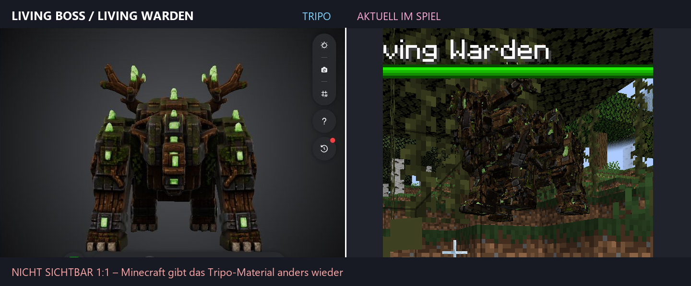

# UMR – Useless Mobs Reworked

UMR ist eine Minecraft-Forge-Mod für 1.20.1, die übersehene Vanilla-Mobs zu eigenständigen Begegnungen mit neuer KI, Bosskämpfen, Progression, Ausrüstung und hoch detaillierten Custom-Modellen ausbaut.

> **Status:** 1.0.0-alpha.2 – spielbarer Entwicklungsstand. Automatische Builds und Regressionstests sind vorhanden; visuelle Modell-, Animations- und Balancing-QA bleibt vor stabilen Releases erforderlich.

## Höhepunkte

- mehrere Slime-Varianten und der mehrphasige King-Slime-Boss
- Corrupted Silverfish mit exaktem 4K-Tripo-Mesh, GeckoLib-Rig und eigenen Bewegungen
- Living Boss und Witch Boss mit Spezialangriffen, Beschwörungen und Schwierigkeitsprofilen
- eigene Varianten von Allay, Squid, Glow Squid, Oktopus, Eisbär, Axolotl, Ozelot, Fledermaus und Husk
- Frost Stray, Coral Drowned und Web Cave Spider mit eigenen Modellen, Sounds und Effekten
- Ausrüstungs-, Kronen-, Talisman- und Progressionssysteme
- optionaler Curios-Slot für Kronen sowie JEI im Entwicklungssetup

Die Mod registriert eigene Entitäten; Vanilla-Renderer werden für diese Varianten nicht global ersetzt.

## Modell- und Renderpipeline

Die komplexen Kreaturen werden nicht zu groben Würfelmodellen vereinfacht:

**Tripo-Export → verlustfreies Blockbench-Rig → binäres Laufzeit-Mesh → GeckoLib-Bones → eigener Mesh-Renderer**

Die aktive Corrupted-Silverfish-Ressource enthält 101'723 Dreiecke, acht Bones und eine 4096×4096-Textur. Weitere Tripo-Modelle verwenden dieselbe Exact-Mesh-Pipeline. Positionsbasierte Bewegungsfelder halten ungewichtete Oberflächen an ihren Nähten geschlossen.

## Voraussetzungen

- Minecraft Java Edition 1.20.1
- Minecraft Forge 47.4.16
- GeckoLib 4.8.3
- Curios 5.10 oder neuer: optional
- JEI 15.20 oder neuer: optional

## Installation

1. Forge 47.4.16 für Minecraft 1.20.1 installieren.
2. GeckoLib 4.8.3 und die aktuelle UMR-JAR in den mods-Ordner legen.
3. Optional Curios und JEI ergänzen.
4. Minecraft mit dem passenden Forge-Profil starten.

Vorhandene Testwelten behalten die technische Mod-ID **usless_mobs**. Diese absichtlich unveränderte ID schützt gespeicherte Registry-Daten, obwohl der sichtbare Name korrigiert wurde.

## Aus dem Quellcode bauen

Benötigt werden Git und Java 17.

    git clone https://github.com/AleksZyro/UMR-Useless-mobs-reworked-Mod.git
    cd UMR-Useless-mobs-reworked-Mod
    ./gradlew build

Unter Windows:

    .\gradlew.bat build

Das erzeugte Mod-Artefakt liegt anschliessend unter **build/libs/**.

## Qualitätssicherung

    python tools/verify_umr_project_truth.py
    python -m pytest -q
    .\gradlew.bat clean build

Automatisch prüfbar sind unter anderem Registrierungen, Ressourcen, Mesh-/Texturverträge, Hitboxen, Bossprofile und der Forge-Build. Die vollständige manuelle Matrix für Client, Server, Modelle und Kompatibilität steht in [docs/QA_CHECKLIST.md](docs/QA_CHECKLIST.md).

## Technik

- Java 17
- Minecraft Forge 1.20.1 / ForgeGradle
- GeckoLib 4
- Gradle 8.8 Wrapper
- Python-basierte Asset-, Mesh- und Regressionstests
- optionale Curios- und JEI-Integration
- GitHub Actions für Pull-Request-Prüfungen

## Projektstruktur

- **src/main/java/** – gemeinsame Modlogik, Registrierungen, KI und Renderer
- **src/main/mobs/** – ältere featurebezogene Quellsets
- **src/main/resources/** – Laufzeitressourcen
- **Modelle/Exports/** – nachvollziehbare Modellquellen und Review-Artefakte
- **tools/** – Konvertierung, Validierung und Regressionstests
- **docs/** – aktive Projektwahrheit, Spezifikationen und QA

Generierte Modellartefakte werden nicht wie handgeschriebener Business-Code behandelt. Änderungen an aktiven Laufzeit-Meshes müssen über die dokumentierte Pipeline und die Projektwahrheitsprüfung nachgewiesen werden.

## Entwicklung und Beiträge

Der Entwicklungsablauf, Commit-Konventionen und die Anforderungen für visuelle Änderungen stehen in [CONTRIBUTING.md](CONTRIBUTING.md). Änderungen werden in [CHANGELOG.md](CHANGELOG.md) dokumentiert.

## Entwickler

- Andrin Maag
- Aleksandar Nikolic

## Lizenz

UMR steht unter der [GNU General Public License v3.0](LICENSE) (GPL-3.0-only).
