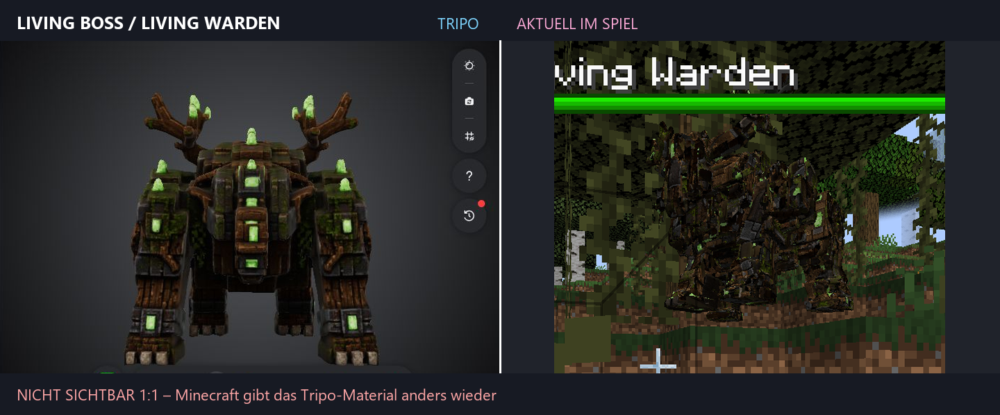

# UMR – Useless Mobs Reworked

**English** | [Deutsch](README.md)

[](https://github.com/AleksZyro/UMR-Useless-mobs-reworked-Mod/actions/workflows/build.yml)
[](https://www.minecraft.net/)
[](https://files.minecraftforge.net/)
[](LICENSE)

UMR is a Minecraft Forge mod for 1.20.1 that turns overlooked vanilla mobs into distinct encounters with new AI, boss fights, progression, equipment and highly detailed custom models.

> **Status:** 1.0.0-alpha.2 – playable development build. Automated builds and regression tests are available; visual model, animation and balancing QA is still required before stable releases.


## Highlights

- multiple slime variants and the multi-phase King Slime boss
- Corrupted Silverfish with an exact 4K Tripo mesh, GeckoLib rig and custom movement
- Living Boss and Witch Boss with special attacks, summons and difficulty profiles
- dedicated variants of Allay, Squid, Glow Squid, Octopus, Polar Bear, Axolotl, Ocelot, Bat and Husk
- Frost Stray, Coral Drowned and Web Cave Spider with custom models, sounds and effects
- equipment, crown, talisman and progression systems
- optional Curios crown slot and JEI support in the development setup

The mod registers its own entities; vanilla renderers are not globally replaced for these variants.

## Model and rendering pipeline

The complex creatures are not reduced to rough cube models:

**Tripo export → lossless Blockbench rig → binary runtime mesh → GeckoLib bones → custom mesh renderer**

The active Corrupted Silverfish resource contains 101,723 triangles, eight bones and a 4096×4096 texture. Other Tripo models use the same exact-mesh pipeline. Position-based deformation fields keep unweighted surfaces closed at their seams.



## Requirements

- Minecraft Java Edition 1.20.1
- Minecraft Forge 47.4.16
- GeckoLib 4.8.3
- TerraBlender 3.0.1.10
- Curios 5.10 or newer: optional
- JEI 15.20 or newer: optional

## Installation

1. Install Forge 47.4.16 for Minecraft 1.20.1.
2. Put GeckoLib 4.8.3, TerraBlender 3.0.1.10 and the current UMR JAR into the `mods` folder.
3. Optionally add Curios and JEI.
4. Start Minecraft with the matching Forge profile. Use only the normal UMR JAR, not source or verification packages.

Existing test worlds keep the technical mod ID **usless_mobs**. This deliberately unchanged ID protects saved registry data even though the visible name has been corrected.

## Building from source

Git and Java 17 are required.

```bash
git clone https://github.com/AleksZyro/UMR-Useless-mobs-reworked-Mod.git
cd UMR-Useless-mobs-reworked-Mod
./gradlew build
```

On Windows:

```powershell
.\gradlew.bat build
```

The generated mod artifact is placed in **build/libs/**.

## Quality assurance

```bash
python tools/verify_umr_project_truth.py
python -m pytest -q
./gradlew clean build
```

The automated checks cover registrations, resources, mesh and texture contracts, hitboxes, boss profiles and the Forge build. The complete manual matrix for client, server, models and compatibility is available in [docs/QA_CHECKLIST.md](docs/QA_CHECKLIST.md).

## Technology

- Java 17
- Minecraft Forge 1.20.1 / ForgeGradle
- GeckoLib 4
- Gradle 8.8 wrapper
- Python-based asset, mesh and regression tests
- optional Curios and JEI integration
- GitHub Actions for pull-request checks

## Project structure

- **src/main/java/** – shared mod logic, registrations, AI and renderers
- **src/main/mobs/** – older feature-specific source sets
- **src/main/resources/** – runtime resources
- **Modelle/Exports/** – traceable model sources and review artifacts
- **tools/** – conversion, validation and regression tests
- **docs/** – active project truth, specifications and QA

Generated model artifacts are not treated like hand-written business code. Changes to active runtime meshes must be demonstrated through the documented pipeline and project-truth verification.

## Development and contributions

The development workflow, commit conventions and requirements for visual changes are documented in [CONTRIBUTING.md](CONTRIBUTING.md). Changes are recorded in [CHANGELOG.md](CHANGELOG.md).

## Developers

- Andrin Maag
- Aleksandar Nikolic

## License

UMR is licensed under the [GNU General Public License v3.0](LICENSE) (GPL-3.0-only).
